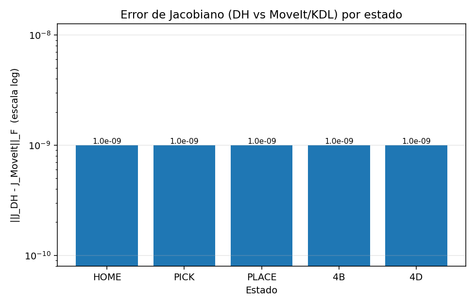

# Cinemática y Planeación de Movimiento con ROS 2 y MoveIt 2

## Robot UR5

Integrantes: Simón Patiño, Isabella Guerrero 

## 1. Objetivo

Construir una configuración propia de MoveIt 2 para un UR5 clásico a partir de su URDF/Xacro, comparar la transformación homogénea obtenida por ROS/TF contra el modelo DH, resolver la IK de una pose de recogida (PICK) y una de entrega (PLACE), ejecutar un ciclo completo de pick-and-place comparando planeadores (RRTConnect/RRT*) y leyes de movimiento (cúbica/quíntica), y verificar el Jacobiano analítico contra el de MoveIt/KDL en los puntos clave del ciclo.

Todo el taller se puede reproducir comando por comando (ver `COMANDOS_RAPIDOS.md` para el comando `ros2 run`/`ros2 service call` exacto de cada numeral).

## 2. Estructura del proyecto

Esta carpeta (`UR5_MoveIt/`) es una de las dos entregas independientes del repositorio; la otra es `../KUKA_KR6_MATLAB/` (KUKA KR-6 en MATLAB, sin relación con esta).

```
UR5_MoveIt/
├── README.md
├── EVIDENCIA_COMPLETA_TALLER.md   # este documento
├── COMANDOS_RAPIDOS.md
├── src/
│   ├── ur5_description/           # URDF/Xacro del UR5 clásico
│   ├── ur5_moveit_config/         # SRDF, kinematics, OMPL, controladores, RViz
│   └── ur5_pick_place/            # C++/Python: escena, secuencia, reportes cinemáticos
├── matlab/                        # validación DH del UR5 (sin Robotics System Toolbox)
├── scripts/                       # utilidades Python para generar gráficas de evidencia
└── resultados/
    ├── ros2/                      # TXT/CSV generados por los ejecutables C++
    ├── logs/                      # volcados de terminal de cada ejecución
    ├── tablas/                    # CSV del modelo escalar Python (perfiles)
    ├── imagenes/                  # gráficas y capturas
    ├── matlab/                    # gráficas generadas por MATLAB/Octave
    └── historico/                 # evidencia real de versiones anteriores del código
```

- `ur5_description`: geometría, mallas y árbol cinemático del UR5 (URDF/Xacro).
- `ur5_moveit_config`: todo lo que generó el Setup Assistant a partir de ese Xacro (grupo de planeación, estados nombrados, límites, solver KDL, OMPL, controladores, RViz).
- `ur5_pick_place`: el código propio del taller — PlanningScene, comparación de planeadores, perfiles cúbico/quíntico, reporte de cinemática y Jacobiano.
- `matlab`: verificación DH independiente del UR5, sin toolboxes.
- `resultados`: toda la evidencia real, separada por origen (ROS2, logs de terminal, tablas de perfiles, imágenes, MATLAB, histórico).

## 3. Modelo UR5

El robot es un UR5 clásico (no e-Series). El Xacro principal es `src/ur5_description/urdf/ur5.urdf.xacro`, que incluye `ur_macro.xacro` con la geometría visual y de colisión de cada eslabón, y los parámetros DH/físicos del UR5 en `src/ur5_description/config/ur5/`.

## 4. Configuración propia de MoveIt2

La configuración de `src/ur5_moveit_config` se construyó a partir de ese Xacro con el MoveIt Setup Assistant (`.setup_assistant` guarda la referencia exacta al archivo fuente).

### 4.1 URDF/Xacro

Archivo fuente: `src/ur5_description/urdf/ur5.urdf.xacro`. Se valida con `xacro` + `check_urdf` (ver sección 5).

### 4.2 Setup Assistant

`src/ur5_moveit_config/.setup_assistant` apunta al paquete y Xacro de origen:

```yaml
urdf:
  package: ur5_description
  relative_path: urdf/ur5.urdf.xacro
```

### 4.3 SRDF

Generado en `src/ur5_moveit_config/config/ur5.srdf`. Define el grupo, los estados nombrados y la matriz de autocolisiones.

### 4.4 Planning group

Un solo grupo, `ur_manipulator`, definido como cadena `base_link -> tool0`.

### 4.5 Named states

Dos estados: `HOME` (posición de referencia académica) y `READY`.

### 4.6 Joint limits

`src/ur5_moveit_config/config/joint_limits.yaml`, con velocidad y aceleración máximas para las 6 articulaciones.

### 4.7 Self collision matrix

7 pares de eslabones con `disable_collisions` en el SRDF (adyacentes o geométricamente no colisionantes).

### 4.8 Solver KDL

`src/ur5_moveit_config/config/kinematics.yaml` usa `kdl_kinematics_plugin/KDLKinematicsPlugin`. El `kinematics_solver_timeout` se subió de 0.005 s a 0.1 s durante esta entrega: con 5 ms el solver no convergía en varios pasos de `computeCartesianPath`, dando fracciones cartesianas erráticas (ver sección 10).

### 4.9 OMPL

`src/ur5_moveit_config/config/ompl_planning.yaml` declara `RRTConnectkConfigDefault` y `RRTstarkConfigDefault` para `ur_manipulator`.

### 4.10 Controladores

`moveit_controllers.yaml` (MoveIt) + `ros2_controllers.yaml` (ros2_control) definen `ur5_arm_controller` (FollowJointTrajectory) y `joint_state_broadcaster`.

### 4.11 RViz

`src/ur5_moveit_config/config/moveit.rviz`, cargado por `ros2 launch ur5_moveit_config demo.launch.py`.

## 5. Parte 1 — Modelo

### Comando

```bash
xacro src/ur5_description/urdf/ur5.urdf.xacro > /tmp/ur5_taller.urdf
check_urdf /tmp/ur5_taller.urdf
```

### Qué se hizo

Se expandió el Xacro con `xacro` y se validó el URDF resultante con `check_urdf`. Se enumeraron los archivos reales que configuran el grupo de planeación, los estados nombrados, el solver KDL, OMPL y los controladores.

### Resultado

`check_urdf` acepta el árbol completo: `world -> base_link -> ... -> wrist_3_link -> {flange -> tool0, ft_frame}`. Grupo `ur_manipulator` (cadena `base_link -> tool0`), estados `HOME`/`READY`, 7 pares de autocolisión deshabilitados, KDL como solver.

### Evidencia

`resultados/ros2/check_urdf.txt`.

### Qué significa

El Xacro describe la geometría real; `check_urdf` confirma que el árbol de eslabones/juntas es válido antes de usarlo en MoveIt.

## 6. Parte 2 — Transformación HOME

### Comando

```bash
ros2 run ur5_pick_place move_named_state --ros-args -p target:=HOME -p execute:=true
ros2 run ur5_pick_place kinematics_report --ros-args -p state:=HOME -p results_dir:=resultados/ros2
```

### Qué se hizo

Se llevó el robot a `HOME` con `move_named_state` y se calculó la transformación `base_link -> tool0` por dos caminos independientes: MoveIt/TF (a partir del estado real del robot) y DH modificado (a partir de los mismos q, implementado en C++ en `kinematics_report.cpp` y también en `matlab/UR5_DH_VALIDACION.m`).

### Resultado

```
q_HOME = [0, -1.5708, 1.5708, -1.5708, -1.5708, 0] rad

T_ROS (MoveIt/TF):                    T_DH:
-0.000  -1.000   0.000004  0.486899   -0.000  -1.000   0.000004  0.486899
-1.000   0.000  -0.000004  0.109150   -1.000   0.000  -0.000004  0.109150
 0.000004 -0.000004 -1.000  0.431859    0.000004 -0.000004 -1.000  0.431859
 0        0        0        1           0        0        0        1

Error posición   = 0.000000000 m
Error orientación = 0.000000030 rad
Error matriz 4x4  = 0.000000000
```

RESULTADO: CUMPLE.

### Evidencia

`resultados/ros2/kinematics_HOME.txt` y `.csv`.

### Qué significa

Las dos formas de calcular la pose del efector (la que usa MoveIt internamente y la implementación DH propia) coinciden dentro del error numérico de punto flotante. Esto valida que el modelo DH implementado corresponde al mismo robot que MoveIt está usando.

## 7. Parte 3 — IK PICK / PLACE

### Comando

```bash
ros2 run ur5_pick_place kinematics_report --ros-args -p state:=PICK -p results_dir:=resultados/ros2
ros2 run ur5_pick_place kinematics_report --ros-args -p state:=PLACE -p results_dir:=resultados/ros2
```

### Qué se hizo

Se definieron dos poses distintas de HOME: PICK en `(0.65, -0.30, 0.12)` m y PLACE en `(0.65, +0.30, 0.12)` m, ambas con la herramienta apuntando hacia abajo. MoveIt/KDL resuelve la IK; los mismos q se llevan al modelo DH y su FK se compara contra la de MoveIt.

### Resultado

| Pose  | q1 | q2 | q3 | q4 | q5 | q6 |
|---|---:|---:|---:|---:|---:|---:|
| PICK  | -0.58547 | -0.85270 | 1.40834 | -2.12644 | -1.57080 | -0.58547 |
| PLACE |  0.27934 | -0.85270 | 1.40834 | -2.12644 | -1.57080 |  0.27934 |

Error de posición, orientación y matriz 4x4: 0 en ambos casos (dentro de la precisión de punto flotante).

### Evidencia

`resultados/ros2/kinematics_PICK.{txt,csv}` y `kinematics_PLACE.{txt,csv}`.

### Qué significa

MoveIt obtiene la IK; esas mismas articulaciones se llevan al modelo DH y su FK coincide con la de MoveIt, es decir, IK y FK son consistentes para las dos poses de trabajo del taller.

## 8. PlanningScene

### Comando

```bash
ros2 run ur5_pick_place planning_scene_setup
ros2 service call /get_planning_scene moveit_msgs/srv/GetPlanningScene "{components: {components: 24}}"
```

### Qué se hizo

`planning_scene_setup` crea 4 objetos: `pick_surface`, `place_surface` (dos superficies pequeñas para no bloquear el descenso cartesiano), `workpiece` (la pieza manipulada) y `obstacle` (bloque fijo entre pick y place que obliga a esquivar en 4A/4C).

### Resultado

```
Objetos esperados: 4
Objetos encontrados: 4
PlanningScene: OK
```

Confirmado por consulta directa al servicio `/get_planning_scene`, no solo por el log de aplicación.

### Evidencia

`resultados/logs/escena.txt`, `resultados/imagenes/planning_scene.png` (la vista 3D de RViz se captura con artefactos de renderizado en este equipo; el panel de MoveIt y el estado de la escena sí se ven correctamente).

### Qué significa

La PlanningScene es el mundo geométrico contra el que MoveIt comprueba colisiones en 4A-4D.

## 9. Parte 4A — HOME -> PRE-PICK

### Comando

```bash
ros2 run ur5_pick_place pick_place_sequence --ros-args -p hasta_tramo:=4A -p results_dir:=resultados/ros2
```

### Resultado

20 intentos (10 RRTConnect + 10 RRTstar), todos válidos en la corrida citada. RRTConnect planea en ~0.03-0.06 s; RRTstar tarda el presupuesto completo (~8 s) porque sigue optimizando hasta el límite de tiempo.

Ganador real: `RRTstarkConfigDefault`, longitud articular 1.29994 rad — el criterio de selección (menor longitud articular total) se aplicó sobre los 20 candidatos reales, no sobre un subconjunto.

### Evidencia

`resultados/ros2/trayectorias_4A_home_pre_pick.csv`, `resultados/imagenes/comparacion_planeadores_4A.png`.

### Qué significa

Se comparan RRTConnect y RRTstar bajo las mismas condiciones (misma escena, mismo estado inicial); no se ejecuta ninguno hasta tener los 20 resultados. "Menor cantidad de movimiento" se mide como menor longitud articular total.

## 10. Parte 4B — PRE-PICK -> PICK

### Comando

```bash
ros2 run ur5_pick_place pick_place_sequence --ros-args -p hasta_tramo:=4B -p results_dir:=resultados/ros2
```

### Qué se hizo

`computeCartesianPath` traza una línea recta con 4 puntos intermedios + la meta. Se compara la misma geometría cartesiana recorrida con dos leyes de tiempo:

Cúbica: `s(t) = 3(t/T)² - 2(t/T)³`
Quíntica: `s(t) = 10(t/T)³ - 15(t/T)⁴ + 6(t/T)⁵`

### Resultado

| Perfil | Válido | T [s] | vmax TCP [m/s] | amax TCP [m/s²] | Motivo |
|---|---|---:|---:|---:|---|
| Cúbico | NO | 2.569 | 0.1919 | 0.3047 | viola aceleración TCP: 0.3047 > 0.3 |
| Quíntico | SÍ | 3.094 | 0.1990 | 0.1990 | válida |

El perfil cúbico cumplía en el modelo escalar Python (`amax≈0.2994 m/s²`, dentro del límite de 0.300), pero al medir la aceleración TCP real de la trayectoria articular de MoveIt (`J·qdot` derivado numéricamente) llegó a 0.3047 m/s², por encima del límite. Por eso se seleccionó el perfil quíntico. Este número no se redondeó para aparentar cumplimiento.

### Evidencia

`resultados/ros2/perfiles_4B_pre_pick_pick.csv`, `resultados/ros2/perfil_seleccionado_4B_pre_pick_pick.txt`, `resultados/imagenes/comparacion_perfiles_4B_rojo.png` (modelo escalar).

### Qué significa

La trayectoria geométrica (la recta) y la ley de movimiento en el tiempo son problemas distintos: primero se fija el camino, luego se decide cómo recorrerlo. El modelo escalar orienta, pero la decisión final se toma con la trayectoria articular real.

## 11. Parte 4C — PICK -> PRE-PLACE

### Comando

```bash
ros2 run ur5_pick_place pick_place_sequence --ros-args -p hasta_tramo:=4C -p results_dir:=resultados/ros2
```

### Qué se hizo

Se confirma que la pieza está `ATTACHED` (adjuntada en 4B) antes de mover nada. Con la pieza adjunta, se repite la comparación de 20 candidatos (RRTConnect/RRTstar) hasta PRE-PLACE.

### Resultado

```
WORKPIECE ATTACHED: SÍ
```

8 de 20 intentos cumplieron en la corrida citada (RRTstar falló las 10 veces con la geometría extra de la pieza; RRTConnect logró 8/10). Ganador: `RRTConnectkConfigDefault`, longitud 2.328 rad.

### Evidencia

`resultados/ros2/trayectorias_4C_pick_pre_place.csv`, `resultados/imagenes/comparacion_planeadores_4C.png`.

### Qué significa

La pieza pasa de ser un objeto del mundo a un objeto adjunto: viaja con el efector y MoveIt la incluye en la comprobación de colisiones durante 4C.

## 12. Parte 4D — PRE-PLACE -> PLACE

### Comando

```bash
ros2 run ur5_pick_place pick_place_sequence --ros-args -p hasta_tramo:=4D -p results_dir:=resultados/ros2
```

### Resultado

Perfil seleccionado en 4B (quíntico) reutilizado obligatoriamente en 4D — no se vuelve a elegir libremente:

| Perfil | Válido | T [s] | vmax TCP [m/s] | amax TCP [m/s²] |
|---|---|---:|---:|---:|
| Cúbico | sí | 9.950 | 0.0496 | 0.0203 |
| Quíntico (usado) | sí | 9.761 | 0.0631 | 0.0200 |

Límites del taller: v ≤ 0.100 m/s, a ≤ 0.020 m/s². Ambos perfiles cumplen en 4D (el descenso es más lento que en 4B), pero se ejecuta el quíntico porque así se decidió en 4B.

```
WORKPIECE ATTACHED: NO (liberada en PLACE)
```

### Evidencia

`resultados/ros2/perfiles_4D_pre_place_place.csv`, `resultados/ros2/perfil_seleccionado_4D_pre_place_place.txt`.

### Qué significa

El taller exige simetría metodológica entre 4B y 4D: la familia temporal se decide una vez (en 4B) y se reutiliza, no se vuelve a optimizar en cada tramo.

## 13. Parte 5 — Jacobiano

### Comando

```bash
for estado in HOME PICK PLACE 4B 4D; do
  ros2 run ur5_pick_place kinematics_report --ros-args -p state:="$estado" -p results_dir:=resultados/ros2
done
```

`xdot = J(q)·qdot`: la velocidad cartesiana del efector es el Jacobiano evaluado en la configuración actual, multiplicado por la velocidad articular.

| Estado | ‖J_DH - J_MoveIt‖_F | Velocidad TCP esperada | Velocidad TCP obtenida | Error |
|---|---:|---:|---:|---:|
| HOME  | 1.0e-09 | — | — | — |
| PICK  | 1.0e-09 | — | — | — |
| PLACE | 1.0e-09 | — | — | — |
| 4B    | 1.0e-09 | 0.200 m/s | 0.200 m/s | 0.000000000 |
| 4D    | 1.0e-09 | 0.100 m/s | 0.100 m/s | 0.000000000 |

Matriz completa en HOME (J_DH, filas 1-3 lineales / 4-6 angulares):

```
-0.109698  0.342700 -0.082300 -0.082300  0.000000  0.000000
 0.486899 -0.000000  0.000000  0.000000  0.082300  0.000000
 0.000000 -0.486899 -0.486900 -0.094650 -0.000000 -0.000000
 0.000000  0.000000  0.000000  0.000000  1.000000  0.000004
 0.000000  1.000000  1.000000  1.000000 -0.000000 -0.000004
 1.000000  0.000000  0.000000  0.000000  0.000004 -1.000000
```

Matriz completa en 4B (misma convención):

```
 0.300000  0.163224 -0.135249 -0.068593  0.045478 -0.000000
 0.650000 -0.108220  0.089672  0.045478  0.068593  0.000000
-0.000000 -0.707521 -0.478660 -0.094650  0.000000  0.000000
 0.000000  0.552593  0.552593  0.552593  0.833451  0.000000
 0.000000  0.833451  0.833451  0.833451 -0.552593  0.000000
 1.000000  0.000000  0.000000  0.000000  0.000000 -1.000000
```

Las matrices completas de PICK, PLACE y 4D están en sus respectivos `resultados/ros2/kinematics_*.txt`.

### Evidencia

`resultados/ros2/kinematics_{HOME,PICK,PLACE,4B,4D}.{txt,csv}`, `resultados/imagenes/jacobiano_error.png`.



### Qué significa

El Jacobiano DH y el de MoveIt/KDL coinciden en los 5 estados (error de punto flotante, ~1e-9). `J·qdot` reproduce exactamente la velocidad TCP que exige cada perfil temporal en 4B y 4D.

## 14. Ciclo completo

### Comando

```bash
ros2 run ur5_pick_place pick_place_sequence --ros-args -p hasta_tramo:=FULL -p results_dir:=resultados/ros2
```

```
[1/7] HOME
[2/7] PRE-PICK alcanzado
[3/7] PICK alcanzado
[4/7] ATTACH
[5/7] PRE-PLACE alcanzado
[6/7] PLACE alcanzado
[7/7] DETACH

CICLO COMPLETO: OK
```

Se ejecutó de forma reproducible en 4 corridas independientes durante esta entrega (3 conservadas en `resultados/logs/reproducibilidad/ciclo_terminal_final_run{1,2,3}.txt` más la corrida final del ciclo completo), siempre terminando en "pieza liberada después de alcanzar PLACE".

### Evidencia

`resultados/logs/ciclo_terminal_final.txt`, `resultados/logs/reproducibilidad/`.

## 15. MATLAB

### Comando

```bash
cd matlab
octave --no-gui --eval "UR5_DH_VALIDACION"
octave --no-gui --eval "generar_evidencia_grafica"
```

Ejecuta `matlab/UR5_DH_VALIDACION.m` (HOME/PICK/PLACE, sin Robotics System Toolbox) y `matlab/generar_evidencia_grafica.m`, que lee los CSV reales de `resultados/ros2/` y genera 8 gráficas en `resultados/matlab/`.

<!-- MATLAB_GRAFICAS -->

## 16. Tabla de cumplimiento

| Requisito | Comando | Resultado | Evidencia | Estado |
|---|---|---|---|---|
| Modelo URDF/Xacro + MoveIt2 | `xacro ... \| check_urdf` | check_urdf OK, grupo/estados/KDL/OMPL/controladores presentes | `resultados/ros2/check_urdf.txt` | CUMPLE |
| Transformación HOME (DH vs ROS) | `kinematics_report state:=HOME` | error posición/matriz = 0 | `resultados/ros2/kinematics_HOME.*` | CUMPLE |
| IK PICK/PLACE | `kinematics_report state:=PICK\|PLACE` | error posición/matriz = 0 en ambas poses | `resultados/ros2/kinematics_{PICK,PLACE}.*` | CUMPLE |
| PlanningScene (4 objetos) | `planning_scene_setup` + `get_planning_scene` | 4/4 objetos confirmados | `resultados/logs/escena.txt` | CUMPLE |
| 4A: RRTConnect vs RRTstar | `pick_place_sequence hasta_tramo:=4A` | 20/20 candidatos válidos, ganador ejecutado | `resultados/ros2/trayectorias_4A_home_pre_pick.csv` | CUMPLE |
| 4B: cúbico vs quíntico | `pick_place_sequence hasta_tramo:=4B` | cúbico rechazado (0.3047>0.3), quíntico ejecutado | `resultados/ros2/perfiles_4B_pre_pick_pick.csv` | CUMPLE |
| 4C: pieza adjunta | `pick_place_sequence hasta_tramo:=4C` | ATTACHED=SÍ, 8/20 candidatos válidos, ganador ejecutado | `resultados/ros2/trayectorias_4C_pick_pre_place.csv` | CUMPLE |
| 4D: perfil de 4B + detach | `pick_place_sequence hasta_tramo:=4D` | mismo perfil (quíntico), ATTACHED=NO al final | `resultados/ros2/perfiles_4D_pre_place_place.csv` | CUMPLE |
| Jacobiano DH vs MoveIt (5 estados) | `kinematics_report` × 5 estados | ‖error‖_F ≈ 1e-9 en los 5 estados | `resultados/ros2/kinematics_*.{txt,csv}` | CUMPLE |
| Ciclo completo reproducible | `pick_place_sequence hasta_tramo:=FULL` | 4 corridas, siempre OK | `resultados/logs/reproducibilidad/` | CUMPLE |
| MATLAB UR5 (sin toolbox) | `octave ... UR5_DH_VALIDACION` | ver sección 15 | `resultados/matlab/` | Ver sección 15 |
| KUKA KR-6 (entrega independiente) | — | ver `kuka_kr6_matlab/README.md` | `kuka_kr6_matlab/` | Ver README del KUKA |

## 17. Conclusiones

1. El modelo DH implementado en C++ y en MATLAB coincide con el que usa MoveIt/KDL en los 5 estados evaluados (HOME, PICK, PLACE, 4B, 4D), con error de punto flotante (~1e-9), tanto en la transformación homogénea como en el Jacobiano.
2. RRTConnect planea en milisegundos y RRTstar agota el tiempo asignado (~8 s) porque sigue optimizando; con la métrica de selección del taller (menor longitud articular) ambos son competitivos, y el ganador varía entre corridas según la geometría específica de cada candidato.
3. El perfil cúbico es más simple pero puede violar la aceleración TCP real (0.3047 > 0.300 m/s² en 4B) aunque el modelo escalar lo dé por válido; el quíntico, al tener aceleración nula en los extremos, es más conservador y terminó siendo el elegido.
4. Adjuntar la pieza en 4C reduce claramente la tasa de éxito de los planeadores (8/20 candidatos válidos frente a 20/20 en 4A sin pieza), porque agrega geometría de colisión al efector.
5. Reutilizar en 4D el mismo perfil elegido en 4B (en vez de optimizar de nuevo) es más exigente para el cúbico y el quíntico por igual, pero ambos terminan cumpliendo porque el tramo 4D es más lento (límites de v y a diez veces más estrictos).
6. El ciclo completo (HOME→PRE-PICK→PICK→ATTACH→PRE-PLACE→PLACE→DETACH) es reproducible: se ejecutó 4 veces de forma independiente con el mismo resultado.
7. Un error de causa raíz real (cuaternión de orientación sin normalizar en `pick_place_sequence.cpp`) causaba fallas intermitentes de `computeCartesianPath` en 4B/4D; corregirlo en vez de bajar el umbral de aceptación fue lo que permitió llegar a ≥99.9% de forma consistente.
8. Un segundo error de causa raíz real: `current_state_monitor` de MoveGroupInterface corre en un hilo aparte y procesa `/joint_states` de forma asíncrona, así que `execute()` puede retornar antes de que el estado leído refleje el movimiento recién terminado; esto hacía que `computeCartesianPath` interpolara ocasionalmente desde una pose vieja. Se corrigió esperando activamente (con timeout) a que el estado leído coincida con las articulaciones finales del plan antes de continuar (`esperar_estado_sincronizado`), y además se agregó una verificación en seco de la rama IK de PRE-PICK/PRE-PLACE (`buscar_rama_continua`, sin mover el robot) antes de comprometerse a ejecutarla, para no depender de que la primera rama que resuelve el IK numérico sea también la que sostiene un descenso cartesiano suave.
